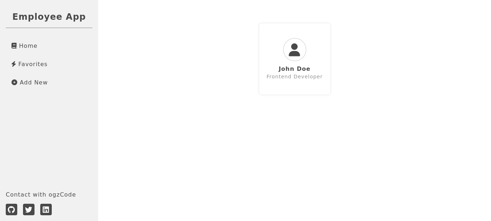
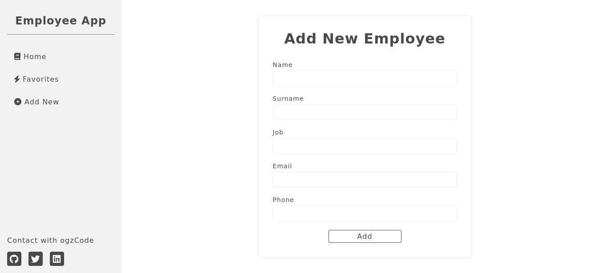
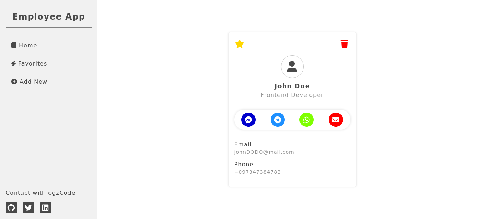

# Flask Employee App
Python ve Flask kullanarak geliştirdiğim çalışan rehberi uygulaması.

## Uygulamayı Çalıştırma
Uygulamayı çalıştırmak için aşağıdaki eklentileri `pip` komutu ile yükleyin.<br>
Ardından bu komutlar ile uygulamayı çalıştırabilirsiniz.
```
export FLASK_APP=app
export FLASK_ENV=development
flask run
```
## Kullandığım Teknolojiler
* Flask
* Flask-SQLAlchemy
* Flask-WTF

### Öğrendiklerim ve Uyguladıklarım
* Flask-WTF ile Web formlarını kullanmak
* Flask-SQLAlchemy ile sınıf tabanlı veri modelleri oluşturmak
* SQLAlchemy yardımı ile CRUD işlemleri gerçekleştirmek

#### Ekran Görüntüleri

<hr>

#### Ana Ekran


<hr>

#### Ekleme Ekranı


<hr>

#### Tek İşçi Ekranı
 

